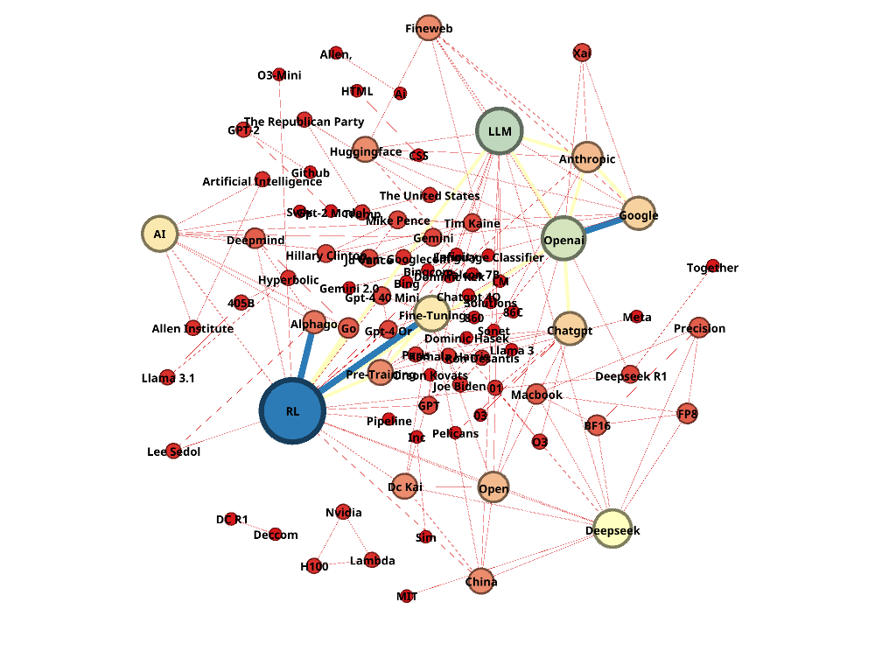
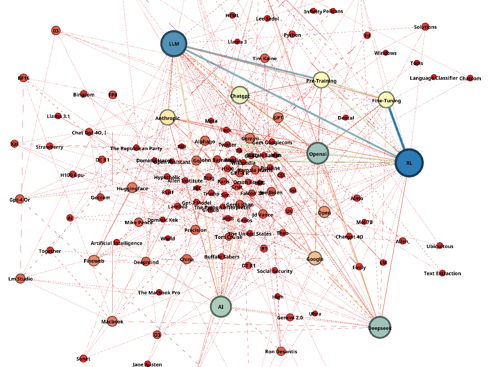
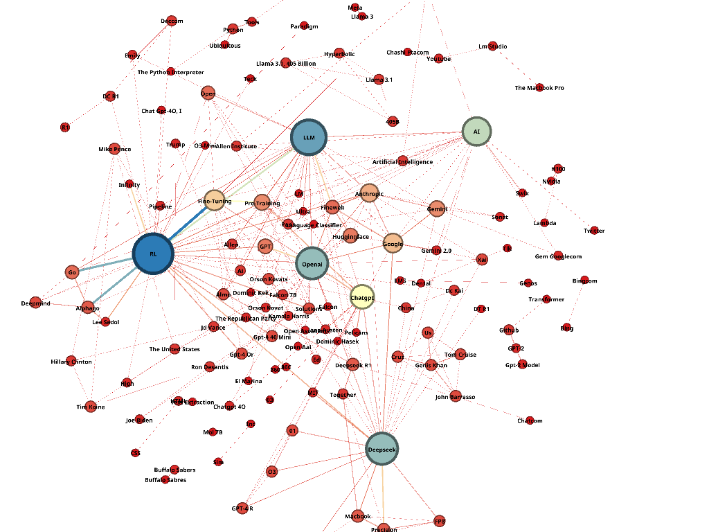

  
  
  

<h1 align="center">Redes de Coocorrência de Entidades em Videocasts</h1>

  Projeto de extração de Entidades Nomeadas (NER) e análise de grafos de coocorrência variando janelas de distância topológica. Desenvolvido para a Unidade 01 da disciplina de Algoritmos e Estruturas de Dados II.

## 1. Integrantes
A equipe de desenvolvimento é composta por:
- **HENRIQUE EDUARDO COSTA DA SILVA:** responsável pela etapa de NER (extração de entidades nomeadas).
- **MURILO DE LIMA BARROS:** responsável pela coleta, organização dos dados e pré-processamento textual.
- **RAMON VINICIUS FERREIRA DE SOUZA:** responsável pelos grafos e pela análise dos resultados.

---

## 2. Descrição das Atividades Realizadas

O projeto foi estruturado como um pipeline completo de processamento de linguagem natural e análise de redes de coocorrência de entidades, a partir de transcrições de videocasts no YouTube.

### 2.1. Aquisição e Agregação de Dados

- **Fonte de Dados:** Transcrições oficiais do YouTube de episódios densos sobre inteligência artificial (Ex: Andrej Karpathy introduzindo LLMs).
- **Extração (`youtube-transcript-api`):** As transcrições nativas fornecem textos "picotados" a cada 3~5 segundos. Para mitigar esse ruído narrativo, implementamos um aglomerador linear que processa as listas em **blocos temporais de 60 segundos**.
- **Registro Físico:** Os dados brutos (e agregados) gerados são salvos em `/data/raw/` como `.txt` fluido e `.json` marcado por timestamps.

### 2.2. PNL e Reconhecimento de Entidades (`src/ner_extraction.py`)
- O processamento de linguagem natural foi realizado com a biblioteca **spaCy**, utilizando o modelo **en_core_web_trf** para reconhecimento de entidades nomeadas (NER).

### 2.3. As Três Janelas de Distância (`src/graph_builder.py`)
No escopo fundamental do trabalho analítico, extraímos parâmetros determinísticos de NetworkX operando definições variadas de topologia de vizinhança:
1. **Modelagem de Sentença:** Restrita; entidades apenas são conectadas se dividirem a mesma abstração frasal gramatical demarcada pelo parser do texto.
2. **Modelagem de Parágrafo:** Aglomerativa; cria coocorrências se entidades habitarem juntas os limites de blocos preestabelecidos de densidade descritiva (nossos blocos de 60s).
3. **Modelagem de K-Caracteres (K=50 Palavras):** Lógica espacial; independente de parágrafos, vizinhanças são traçadas mediante distância limítrofe no vetor.

As extrações resultam em arestas ponderadas exportadas nativamente para a expansão `/data/processed/*.graphml`.

---

## 3. Principais Resultados Obtidos

Os experimentos compararam diferentes janelas de coocorrência (sentença, parágrafo e K=50 palavras). O melhor desempenho qualitativo foi observado na **modelagem por parágrafo**, que produziu redes mais informativas e conexões mais coerentes entre entidades no contexto dos episódios analisados.

### 3.1. Grafos Gerados

1 - Grafo por Sentença

2 - Grafo por Parágrafo

3 - Grafo por K=50 Palavras

---

## 4. Análise e Discussão dos Achados

A comparação entre as três abordagens mostrou que a escolha da janela de coocorrência impacta diretamente a estrutura da rede gerada:

- Na **janela por sentença**, as conexões tendem a ser mais precisas, porém mais esparsas.
- Na **janela por K=50 palavras**, há ganho de cobertura, mas as conexões parecem menos semânticas.
- Na **janela por parágrafo**, observou-se o melhor equilíbrio entre contextualização e densidade da rede, tendo o melhor resultado.

De forma geral, os grafos permitiram identificar entidades importanres, padrões de associação e possíveis temas dominantes nas transcrições.

